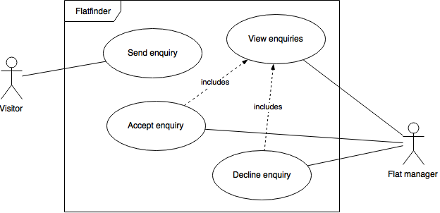
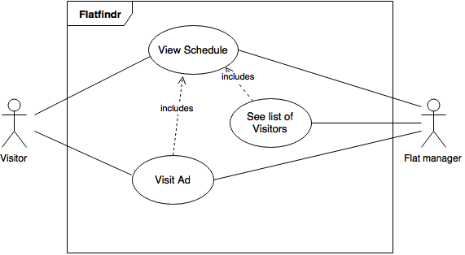

# Software requirements specification

## Introduction

### Purpose

This document gives a detailed description of the requirements for the web application project **FlatFinder**.

All functional and non-functional requirements are listed and documented in this document. The document also gives a brief overview of the overall application and collaborating external systems.

This document serves as basis for discussions with the customer during the initial phase of the project.

Furthermore the document serves as contract between the customer and the developer team, on which both can depend during the whole project.

The document is continuously updated during the whole project. Old versions of the document can be retrieved anytime from the version control system.

### System overview

The web application **FlatFinder** is a web portal for real estate, where users can place ads for real estate. The goal of the customer is to build a web portal which provides the users effective support with doing real estate related tasks like managing enquiries, organizing on site visits and so on.

The system being built bases on a already existing application which should be generally revised and extended with additional functionality.

### Stakeholders

Multiple stakeholders play various roles in the project:

- the **customer**: defines the requirements the system has to fulfill
- the **users**: will use the system
- the **developer team**: will collect the requirements and build the system according to the requirements

### Definitions

The following sections describe abbreviations and special terms used in this document.

#### Domain specific terms

|Term|Description|
|---|---|
|FlatFinder|The web-application for managing ads for real estate|
|Ad|An advertisement for real estate|
|Enquiry|A request of a person to visit real state|
|Real estate manager|The person which manages real estate (places ads, organizes visits)|
|Studio|A small flat with several rooms for rent|
|Room|A single room for rent|

#### Technical terms

|Term|Description|
|---|---|
|DB|Database|
|Java|Programming language used for the project|
|Spring|Spring Framework, a Java framework|
|HTML|Hypertext Markup Language|
|JS|JavaScript, scripting language|
|CSS|Cascading Stylesheets|
|MVC|Model View Controller, a software architecture used in the system|
|Git|A software version control system|

### References

#### Domain specific

- Customer requirements document [https://github.com/scg-unibe-ch/ese2016/wiki/Project-Description](https://github.com/scg-unibe-ch/ese2016/wiki/Project-Description)

#### Technical

- Spring Framework: [https://spring.io](https://spring.io)
- Spring Data: [http://projects.spring.io/spring-data/](http://projects.spring.io/spring-data/)
- Spring MVC: [http://projects.spring.io/spring-framework/](http://projects.spring.io/spring-framework/)
- Spring Security: [http://projects.spring.io/spring-security/](http://projects.spring.io/spring-security/)
- MySQL: [http://www.mysql.com](http://www.mysql.com)

## Overall description

### Use cases

#### User management

|Use case element|Description|
|:---|:---|
|**ID**|uc01|
|**Name**|Sign up|
|**Description**|The user creates a flatfinder account.|
|**Primary actor**|User visiting the web portal|
|**Precondition**|The user visits the start page of the web portal. The user has no flatfinder account yet.|
|**Trigger**|A visitor wants to use the application|
|**Normal flow**|1. The user clicks on the button "login"|
||2. The login form and a link "sign up" is shown|
||3. The user clicks on the link "sign up"|
||4. The sign up form is shown|
||5. The user enter his name, his email address, a password and selects his gender|
||6. The user clicks on the button "Sign up"|
||7. The login page and a success message are shown|
|**Alternate flow**|If the user doesn't fill up the entire sign up form in step 5, validation error messages are shown.|

|Use case element|Description|
|:---|:---|
|**ID**|uc02|
|**Name**|Login|
|**Description**|The user logs into the application|
|**Primary actor**|The user of the web application|
|**Precondition**|The user has signed up for an account and visits the start page of the web portal.|
|**Trigger**|The user wants to use the application|
|**Normal flow**|1. The user clicks on the button "login"|
||2. The login form is shown|
||3. The user enters his email address and his password|
||4. The user clicks on the button "Login"|
||5. The user is logged in and the start page is shown|
|**Alternate flow**|If the user enters wrong credentials in step 3, an error message and the login form are shown.|

|Use case element|Description|
|:---|:---|
|**ID**|uc03|
|**Name**|Edit public profile|
|**Description**|The user edits his public profile, which is shown to other users.|
|**Primary actor**|The user of the web application|
|**Precondition**|The user is logged into the application.|
|**Trigger**|The user wants to edit his public profile.|
|**Normal flow**|1. The user hovers over his user image in the header line of the web portal|
||2. The user clicks on the appearing button "Public profile"|
||3. His public profile information is shown|
||4. The user clicks on the button "Edit"|
||5. The form to edit his personal information like name, password and email is shown|
||6. The user changes some values|
||7. The user clicks on the button "Update"|
||8. The system shows a success message|
|**Alternate flow**|If the user enters invalid input, an error message is shown.|

|Use case element|Description|
|:---|:---|
|**ID**|uc04|
|**Name**|Logout|
|**Description**|The user logs out of the application|
|**Primary actor**|The user of the web application|
|**Precondition**|The user is logged into the the application.|
|**Trigger**|The user wants to leave the application|
|**Normal flow**|1. The user hovers over his user image in the header line of the web portal|
||2. The user clicks on the appearing button "Logout"|
||3. The user is logged out and the start page of the web portal is shown|
|**Alternate flow**||

#### Searching and viewing ads

#### Creating an ad

#### Messaging

#### Enquiries

#### Alerts

#### Schedule

|Use case element|Description|
|:---|:---|
|**ID**||
|**Name**||
|**Description**||
|**Primary actor**||
|**Precondition**||
|**Trigger**||
|**Normal flow**||
|**Alternate flow**||

see [http://www.gatherspace.com/static/use_case_example.html](http://www.gatherspace.com/static/use_case_example.html)

### Actor characteristics

## Requirements

### Functional requirements

#### User management

- The user can login to the application.
Therefore he has to enters his email-address and his password into the login-form. 
If he has no account yet, he can sign up as a new user.

- For signing up as a new user he has to enter his first and last name, select his gender and give his email-address and a passwort, which has to be at least 6 characters long. If any of these informations aren't fill in, an error occurs, which tells the user that he must fill in a valid information.

- When the user is logged in, he can logout by clicking on his name on the top right and then selecting "logout".

- When the user is logged in, he can edit his public profile by clicking on his name on the top right  and selecting "Public Profile". Then he has to click on the Button " Edit Profile". There he can change his passwort, first name, last name, username and write something about himself. By clicking " update " his changes will be saved.

#### Messaging system

- The logged in user can send messages by visiting the advertiser Profile and clicking on the button "Message". Then he can enter the subject and his message and click on "Send" if the want to send the message or click on "Cancel" to exit the message form. If no subject is filled in, the message won't be send. If the subject is entered but no message, then the message wont'be send. Only of both( subject and message) are entered, the message will be send.

- An other way of sending messages for logged in user is by clicking on his name on the top right and then selecting "Messages" then clicking on "New". Then he has to specify to whom he wants to send the email and give in the subject and write his message. Then he can click either "send"(for sending the message) or "cancle"(for leaving the message form).If the user puts in a invalid email address of the recipient then there will appear a box saying :"This user does not exist". Again all information (to, subject, and message) have to be filled in, if not, the message won't be send.

- The logged in user can view his sent messages by clicking on his name on the top right and then selecting "Messages" and then clicking on "Sent". In a chart he can see the subject, sender, recipient and the date sent from each messege he has ever sent. By clicking on a line from this chart he gets a view of the send message.

- The logged in user can view incomming messages by clicking on his name on the top right, then selecting "Messages", then clicking "Inbox". In a chart at the right he can see the subject, sender, recipient and the date sent from the each message he has received. By clicking on a line from this chart he gets a view of the message.

- **NEW** A user can create search alerts which notify him about new ads corresponding the search criteria.

#### Placement of advertisements

A real estate manager can create a new advertisement for real estate. An advertisement consists of required general information and additonal optional information about the real estate it concerns.

The following general information can be declared:

- The *title* of the advertisement (text)
- The *type* of the real estate (room or studio)
- The *location* of the real estate (*street* and *zip code*)
- The *move-in date*
- The *move-out date* (optional)
- The *price per month*
- The *size* of the real estate in square meters

The following *additional attributes* of the real estate can be specified in a yes/no manner:

- animals are allowed
- smoking inside is allowed
- a garden belongs to the real estate
- a cellar or attic belongs to the real estate
- cable TV is available
- WIFI is available
- the real estate is furnished
- a balcony or patio belongs to the real estate
- a garage belongs to the real estate

Additionally a *textual description* of the real estate can be added to the ad.

*Images* of the real estate can be added to the advertisement to give users a better impression of the real estate. This is not mandatory.

The advertiser can state his *preferences* in questions of tenants with a textual description. This is not mandatory.

The *roommates* living in the real estate can be mentioned in the advertisement. The advertiser can add their email-address (flatfinder account) to the advertisement. Additionally a brief text describing the roommates can be stored. This is not mandatory.

The advertiser can specify multiple possible *visiting times* for enquiries. A visiting time is specified by a date, a start time and an end time. This is not mandatory.

#### User roles

**NEW** The application distinguishes two different user types: *premium* and *normal*.

The application behaves different for the different user roles as follows:

- If a new advertisement meets the filter criteria of an alert of a premium user, he immediately gets a message.
- In the same situation, a normal user gets the information with a specific delay.
- The advertisement of premium users are shown at the top of the search result list.

### Non-functional requirements

#### Design of the application

The application should have a modern look and feel.